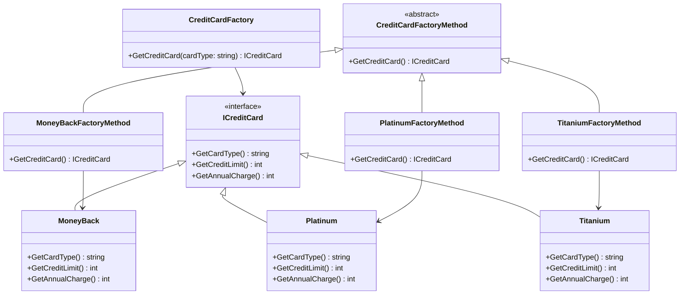

!INCLUDE mermaid.md

# Diagrama de Clases - Bank Domain

```mermaid
classDiagram
    class ICreditCard {
        <<interface>>
        +GetCardType() string
        +GetCreditLimit() int
        +GetAnnualCharge() int
    }
    
    class MoneyBack {
        +GetCardType() string
        +GetCreditLimit() int
        +GetAnnualCharge() int
    }
    
    class Platinum {
        +GetCardType() string
        +GetCreditLimit() int
        +GetAnnualCharge() int
    }
    
    class Titanium {
        +GetCardType() string
        +GetCreditLimit() int
        +GetAnnualCharge() int
    }
    
    class CreditCardFactory {
        +GetCreditCard(cardType: string) ICreditCard
    }
    
    class CreditCardFactoryMethod {
        <<abstract>>
        +GetCreditCard() ICreditCard
    }
    
    class MoneyBackFactoryMethod {
        +GetCreditCard() ICreditCard
    }
    
    class PlatinumFactoryMethod {
        +GetCreditCard() ICreditCard
    }
    
    class TitaniumFactoryMethod {
        +GetCreditCard() ICreditCard
    }
    
    ICreditCard <|-- MoneyBack
    ICreditCard <|-- Platinum
    ICreditCard <|-- Titanium
    
    CreditCardFactory --> ICreditCard
    CreditCardFactoryMethod <|-- MoneyBackFactoryMethod
    CreditCardFactoryMethod <|-- PlatinumFactoryMethod
    CreditCardFactoryMethod <|-- TitaniumFactoryMethod
    
    MoneyBackFactoryMethod --> MoneyBack
    PlatinumFactoryMethod --> Platinum
    TitaniumFactoryMethod --> Titanium
```

Este diagrama será actualizado automáticamente por el sistema de CI/CD.